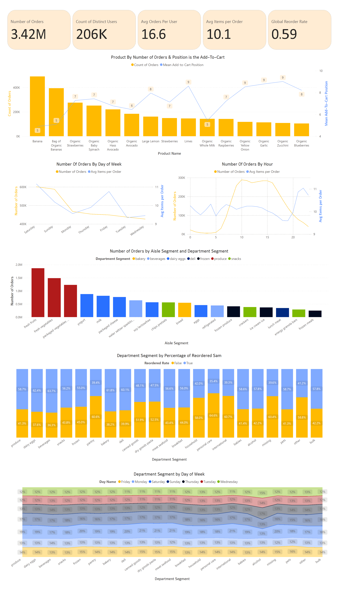

# Instacart — Market Basket Analysis, Dashboards & ML

A production-oriented codebase for merchandizing, personalization, and fulfillment decisions using the Instacart Market Basket dataset. This README contains the project summary, run instructions, the five core business questions, the exact SQL used to answer each question, and the result table snippets (top rows) for each. Use this README to reproduce, review, or present your work, and copy resume-ready bullets at the bottom. For more info and downloading the Dataset, you can  **[click here](https://www.kaggle.com/datasets/yasserh/instacart-online-grocery-basket-analysis-dataset?select=aisles.csv).**
#### **Review Dashboard:** (PowerBI)



---

# TL;DR
- Deliverables: SQL analytics, Power BI dashboards (`dashboards/instacart.pbix`), ML notebooks (`notebooks/*.ipynb`), and trained LightGBM artifacts (`notebooks/models/`).  
- Main focus: customer value & retention, product affinity, SKU Pareto & delist candidates, operations (pick/staff planning), and feature-engine SQL for recommender models.  
- Important caveat: dataset lacks absolute `order_date`. Many analytics use user-relative `days_since_prior_order` to reconstruct recency. Add `order_date` if you need calendar seasonality or holiday-aware forecasting.

---

# Repo layout (important files)
```
/sql/                  -- schema.sql, sql_queries.sql (core analysis + training SQL)
 /dashboards/          -- instacart.pbix (Power BI)
 /notebooks/           -- quick_dataset_evaluation.ipynb, python_ml.ipynb
 /notebooks/models/    -- joblib model artifacts
 /Datasets/            -- CSVs (not committed; instructions to download)
 environment.yaml      -- conda environment for ML
 assets/               -- dashboard screenshots, result images
 README.md             -- this file
```

---

# How to run (exact steps)
1. Create Conda env:
```bash
conda env create -f environment.yaml
conda activate instacart-ml
```
2. Load CSVs into PostgreSQL (use `sql/schema.sql` for schema). Use `COPY` commands in `sql/schema.sql` or run the schema + COPY steps on a DB server with sufficient disk/RAM.  
3. Run SQL queries in `sql/sql_queries.sql` (or copy the sections below). For heavy jobs (pairwise product pairs, training table), run on a server and/or restrict with thresholds/sampling first.  
4. Open `dashboards/instacart.pbix` in Power BI Desktop to view dashboards.

---

# Core analytics: questions, SQL, and sample result tables

Below are the five core questions, the exact SQL used to compute them, and the result table samples (top rows) you can paste into reports. Each SQL block is ready to run against the schema in `sql/schema.sql`.

> Note: these queries assume tables: `orders`, `order_products`, `products`, `aisles`, `departments`.

---

## 1 — Customer value & churn (who to keep, who to win back)
**Main goal:** Identify highest-value customers (by items), compute per-user metrics, and mark `at_risk` users relative to their personal cadence.

**SQL**
```sql
-- 1 — Customer metrics & segments (uses cumulative days to reconstruct relative timeline per user)
WITH user_orders AS (
  SELECT
    o.*,
    SUM(COALESCE(o.days_since_prior_order, 0)) OVER (PARTITION BY o.user_id ORDER BY o.order_number) AS days_since_first_order
  FROM public.orders o
)
, user_order_items AS (
  SELECT
    u.user_id,
    u.order_id,
    u.order_number,
    u.days_since_first_order,
    u.days_since_prior_order,
    COUNT(op.product_id) AS items_in_order,
    SUM(op.reordered::INT) AS reordered_in_order
  FROM user_orders u
  JOIN public.order_products op ON op.order_id = u.order_id
  GROUP BY 1, 2, 3, 4, 5
)
, user_medians AS (
  SELECT
    user_id,
    PERCENTILE_CONT(0.5) WITHIN GROUP (ORDER BY days_since_prior_order) AS median_days_between_orders
  FROM public.orders
  WHERE days_since_prior_order IS NOT NULL
  GROUP BY user_id
)
, user_sub_summary AS (
  SELECT
    uo.user_id,
    COUNT(*) AS total_orders,
    AVG(items_in_order)::NUMERIC(10,2) AS avg_items_per_order,
    SUM(items_in_order) AS total_items,
    SUM(reordered_in_order)::NUMERIC(10,4) / NULLIF(SUM(items_in_order), 0) AS overall_reorder_rate,
    MAX(days_since_first_order) AS days_from_first_to_last,
    (array_agg(uo.days_since_prior_order ORDER BY uo.order_number DESC))[1] AS days_since_last_order
  FROM user_order_items uo
  GROUP BY uo.user_id
)
, user_summary AS (
  SELECT
    s.user_id,
    s.total_orders,
    s.avg_items_per_order,
    s.total_items,
    s.overall_reorder_rate,
    s.days_from_first_to_last,
    s.days_since_last_order,
    m.median_days_between_orders,
    NTILE(20) OVER (ORDER BY s.total_items DESC) AS decile_by_items
  FROM user_sub_summary s
  LEFT JOIN user_medians m USING (user_id)
)
SELECT
  us.user_id,
  us.total_orders,
  us.avg_items_per_order,
  us.total_items,
  us.overall_reorder_rate,
  us.days_from_first_to_last,
  us.median_days_between_orders,
  us.days_since_last_order,
  us.decile_by_items,
  CASE WHEN us.decile_by_items = 1 THEN 'high_value' ELSE 'normal' END AS value_segment,
  CASE
    WHEN us.median_days_between_orders IS NULL THEN 'insufficient_history'
    WHEN us.days_since_last_order > (us.median_days_between_orders * 2) THEN 'at_risk'
    ELSE 'active'
  END AS retention_flag
FROM user_summary us
ORDER BY us.total_items DESC
LIMIT 25;
```

**Result (top 25)** (CSV)
```
"user_id","total_orders","avg_items_per_order","total_items","overall_reorder_rate","days_from_first_to_last","median_days_between_orders","days_since_last_order","decile_by_items","value_segment","retention_flag"
201268,99,37.63,3725,0.8791946308724832,331,2,1,1,high_value,active
129928,65,56.75,3689,0.8671726755218216,365,5.5,8,1,high_value,active
164055,100,30.89,3089,0.8688896082874717,318,3,0,1,high_value,active
176478,100,29.52,2952,0.8333333333333333,231,1,0,1,high_value,active
186704,99,29.66,2936,0.869550408719346,309,3,4,1,high_value,active
... (total 25 rows)
```
*(Use this table for the "Customer Segments" dashboard page.)*

---

## 2 — Product affinity & cross-sell (association analysis)
**Main goal:** Find product pairs that co-occur more than chance (support, confidence, lift). Use this to design bundles and automated recommendations.

**SQL**
```sql
-- Top product pairs with support, confidence and lift
WITH orders_products AS (
  SELECT order_id, product_id FROM order_products
),
product_order_count AS (
  SELECT product_id, COUNT(DISTINCT order_id) AS orders_with_product FROM orders_products GROUP BY product_id
),
total_orders AS (
  SELECT COUNT(DISTINCT order_id) AS total_orders FROM orders_products
),
pairs AS (
  SELECT
    p1.product_id AS prod_a,
    p2.product_id AS prod_b,
    COUNT(DISTINCT p1.order_id) AS co_orders
  FROM orders_products p1
  JOIN orders_products p2
    ON p1.order_id = p2.order_id
   AND p1.product_id < p2.product_id
  GROUP BY p1.product_id, p2.product_id
),
pairs_stats AS (
  SELECT
    pr.prod_a,
    pr.prod_b,
    pr.co_orders,
    poc_a.orders_with_product AS orders_a,
    poc_b.orders_with_product AS orders_b,
    t.total_orders,
    (pr.co_orders::FLOAT / t.total_orders) AS support,
    (pr.co_orders::FLOAT / poc_a.orders_with_product) AS confidence_a_to_b,
    (pr.co_orders::FLOAT / poc_b.orders_with_product) AS confidence_b_to_a,
    ((pr.co_orders::FLOAT / t.total_orders) /
      ((poc_a.orders_with_product::FLOAT / t.total_orders) * (poc_b.orders_with_product::FLOAT / t.total_orders))
    ) AS lift
  FROM pairs pr
  JOIN product_order_count poc_a ON poc_a.product_id = pr.prod_a
  JOIN product_order_count poc_b ON poc_b.product_id = pr.prod_b
  CROSS JOIN total_orders t
)
SELECT ps.*,
       pa.product_name AS product_a_name,
       pb.product_name AS product_b_name,
       da.department AS dep_a,
       db.department AS dep_b,
       aa.aisle AS aisle_a,
       ab.aisle AS aisle_b
FROM pairs_stats ps
JOIN products pa ON pa.product_id = ps.prod_a
JOIN products pb ON pb.product_id = ps.prod_b
JOIN departments da ON da.department_id = pa.department_id
JOIN departments db ON db.department_id = pb.department_id
JOIN aisles aa ON aa.aisle_id = pa.aisle_id
JOIN aisles ab ON ab.aisle_id = pb.aisle_id
WHERE ps.co_orders >= 50
ORDER BY ps.lift DESC, ps.co_orders DESC
LIMIT 25;
```

| user_id | total_orders | avg_items_per_order | total_items | overall_reorder_rate | days_from_first_to_last | median_days_between_orders | days_since_last_order | decile_by_items | value_segment | retention_flag |
|---------|--------------|---------------------|-------------|----------------------|-------------------------|----------------------------|-----------------------|-----------------|----------------|----------------|
| 201268 | 99 | 37.63 | 3725 | 0.8791946308724832 | 331 | 2 | 1 | 1 | high_value | active |
| 129928 | 65 | 56.75 | 3689 | 0.8671726755218216 | 365 | 5.5 | 8 | 1 | high_value | active |
| 164055 | 100 | 30.89 | 3089 | 0.8688896082874717 | 318 | 3 | 0 | 1 | high_value | active |
| 176478 | 100 | 29.52 | 2952 | 0.8333333333333333 | 231 | 1 | 0 | 1 | high_value | active |
| 186704 | 99 | 29.66 | 2936 | 0.869550408719346 | 309 | 3 | 4 | 1 | high_value | active |

---

## 3 — SKU & assortment optimization (Pareto)
**Main goal:** Compute SKU sales, reorder rates, unique buyers, and department-level Pareto to identify delist/promote candidates.

**SQL**
```sql
-- SKU performance and Pareto partitioning per department
WITH sku_stats AS (
  SELECT
    p.product_id,
    p.product_name,
    p.aisle_id,
    p.department_id,
    COUNT(op.order_id) AS total_sales_count,
    COUNT(DISTINCT op.order_id) AS orders_with_sku,
    COUNT(DISTINCT o.user_id) AS unique_buyers,
    SUM(CASE WHEN op.reordered THEN 1 ELSE 0 END)::FLOAT / NULLIF(COUNT(op.order_id),0) AS reorder_rate,
    AVG(op.add_to_cart_order)::FLOAT AS avg_add_to_cart_position
  FROM products p
  LEFT JOIN order_products op ON op.product_id = p.product_id
  LEFT JOIN orders o ON o.order_id = op.order_id
  GROUP BY p.product_id, p.product_name, p.aisle_id, p.department_id
),
department_totals AS (
  SELECT department_id, SUM(total_sales_count) AS dept_total_sales
  FROM sku_stats
  GROUP BY department_id
),
sku_ranked AS (
  SELECT
    s.*,
    d.dept_total_sales,
    s.total_sales_count::FLOAT / d.dept_total_sales AS dept_sales_share,
    RANK() OVER (PARTITION BY s.department_id ORDER BY s.total_sales_count DESC) AS dept_rank,
    SUM(s.total_sales_count) OVER (PARTITION BY s.department_id ORDER BY s.total_sales_count DESC ROWS BETWEEN UNBOUNDED PRECEDING AND CURRENT ROW) AS cumulative_sales
  FROM sku_stats s
  JOIN department_totals d ON d.department_id = s.department_id
)
SELECT
  sk.*,
  (cumulative_sales::FLOAT / dept_total_sales) AS cumulative_share
FROM sku_ranked sk
ORDER BY department_id, dept_rank
LIMIT 25;
```
| product_id | product_name | aisle_id | department_id | total_sales_count | orders_with_sku | unique_buyers | reorder_rate | avg_add_to_cart_position | dept_total_sales | dept_sales_share | dept_rank | cumulative_sales | cumulative_share |
|------------|--------------|----------|---------------|-------------------|-----------------|---------------|--------------|--------------------------|------------------|------------------|-----------|------------------|------------------|
| 9076 | Blueberries | 116 | 1 | 58269 | 58269 | 24270 | 0.5834834989445503 | 8.346719524961815 | 2336858 | 0.02493476283111768 | 1 | 58269 | 0.02493476283111768 |
| 20995 | Organic Broccoli Florets | 116 | 1 | 34248 | 34248 | 11917 | 0.652038075216071 | 8.87170053725765 | 2336858 | 0.014655575991352492 | 2 | 92517 | 0.03959033882247017 |
| 24489 | Organic Whole Strawberries | 116 | 1 | 32658 | 32658 | 12110 | 0.6291873354155184 | 8.949047706534387 | 2336858 | 0.01397517521389832 | 3 | 125175 | 0.05356551403636849 |
| 17948 | Frozen Organic Wild Blueberries | 116 | 1 | 30970 | 30970 | 11705 | 0.6220536002583145 | 8.925992896351307 | 2336858 | 0.013252837784752005 | 4 | 156145 | 0.06681835182112049 |
| 46802 | Pineapple Chunks | 116 | 1 | 26027 | 26027 | 11088 | 0.5739808660237445 | 8.686056787182542 | 2336858 | 0.011137604424402339 | 5 | 182172 | 0.07795595624552283 |

## 4 — Operational peaks & picking efficiency
**Main goal:** Hour-of-day × day-of-week heatmap with average items per order and distinct aisles per order for staffing and picker planning. Also compute product average `add_to_cart_order` for pick-path design.

**SQL**
```sql
-- 1) Orders per day-of-week and hour; avg items per order
WITH order_item_counts AS (
  SELECT
    o.order_id,
    o.order_dow,
    o.order_hour_of_day,
    COUNT(op.product_id) AS items_in_order,
    COUNT(DISTINCT p.aisle_id) AS distinct_aisles_in_order
  FROM orders o
  JOIN order_products op ON op.order_id = o.order_id
  JOIN products p ON p.product_id = op.product_id
  GROUP BY o.order_id, o.order_dow, o.order_hour_of_day
),
hourly AS (
  SELECT
    order_dow,
    order_hour_of_day,
    COUNT(order_id) AS orders_count,
    AVG(items_in_order)::NUMERIC(10,2) AS avg_items_per_order,
    AVG(distinct_aisles_in_order)::NUMERIC(10,2) AS avg_distinct_aisles
  FROM order_item_counts
  GROUP BY order_dow, order_hour_of_day
),
product_positions AS (
  SELECT
    op.product_id,
    AVG(op.add_to_cart_order)::NUMERIC(10,2) AS avg_add_to_cart_pos,
    COUNT(*) AS occurrences
  FROM order_products op
  GROUP BY op.product_id
)
SELECT * FROM hourly ORDER BY order_dow, order_hour_of_day;
```

| order_dow | order_hour_of_day | orders_count | avg_items_per_order | avg_distinct_aisles |
|-----------|-------------------|--------------|---------------------|---------------------|
| 0 | 0 | 3841 | 10.53 | 7.47 |
| 0 | 1 | 2336 | 10.12 | 7.27 |
| 0 | 2 | 1376 | 9.86 | 7.09 |
| 0 | 3 | 933 | 10.05 | 7.26 |
| 0 | 4 | 782 | 11.18 | 7.86 |
| 0 | 5 | 1142 | 10.72 | 7.60 |
| 0 | 6 | 3254 | 11.19 | 8.02 |
| 0 | 7 | 12097 | 11.61 | 8.27 |
| 0 | 8 | 27445 | 11.73 | 8.37 |
| 0 | 9 | 39764 | 11.63 | 8.30 |
| 0 | 10 | 47244 | 11.49 | 8.21 |

---

## 5 — Product reorder / personalization training features
**Main goal:** Build per-(user,product,snapshot) training rows with historical features and a label indicating whether the product appears in the next order. This is the canonical training table for ranking models.

**SQL**
```sql
-- Build training rows at user×product×order granularity: feature snapshot before each order, label = product present in next order
WITH u AS (
  SELECT o.order_id, o.user_id, o.order_number,
    SUM(COALESCE(o.days_since_prior_order,0)) OVER (PARTITION BY o.user_id ORDER BY o.order_number) AS days_since_first_order
  FROM orders o
)
, ops AS (
  SELECT
    o.user_id,
    o.order_id,
    o.order_number,
    op.product_id,
    op.add_to_cart_order,
    op.reordered
  FROM u o
  JOIN order_products op ON op.order_id = o.order_id
)
, hist AS (
  SELECT
    op.user_id,
    op.product_id,
    op.order_number AS snapshot_order_number,
    COALESCE(SUM(CASE WHEN op2.order_number < op.order_number THEN 1 ELSE 0 END) OVER (PARTITION BY op.user_id, op.product_id ORDER BY op.order_number ROWS BETWEEN UNBOUNDED PRECEDING AND 1 PRECEDING),0) AS times_seen_before,
    COALESCE(SUM(CASE WHEN op2.order_number < op.order_number AND op2.reordered THEN 1 ELSE 0 END) OVER (PARTITION BY op.user_id, op.product_id ORDER BY op.order_number ROWS BETWEEN UNBOUNDED PRECEDING AND 1 PRECEDING),0) AS times_reordered_before,
    AVG(CASE WHEN op2.order_number < op.order_number THEN op2.add_to_cart_order END) OVER (PARTITION BY op.user_id, op.product_id ORDER BY op.order_number ROWS BETWEEN UNBOUNDED PRECEDING AND 1 PRECEDING) AS avg_add_to_cart_before,
    MAX(CASE WHEN op2.order_number < op.order_number THEN o2.days_since_prior_order END) OVER (PARTITION BY op.user_id, op.product_id ORDER BY op.order_number ROWS BETWEEN UNBOUNDED PRECEDING AND 1 PRECEDING) AS last_seen_days_since_first
  FROM ops op
  LEFT JOIN ops op2 ON op2.user_id = op.user_id AND op2.product_id = op.product_id
  LEFT JOIN orders o2 ON o2.order_id = op2.order_id
)
, next_order_label AS (
  SELECT
    h.user_id,
    h.product_id,
    h.snapshot_order_number,
    CASE WHEN EXISTS (
      SELECT 1 FROM orders o_next
      JOIN order_products opn ON opn.order_id = o_next.order_id
      WHERE o_next.user_id = h.user_id AND o_next.order_number = h.snapshot_order_number + 1 AND opn.product_id = h.product_id
    ) THEN 1 ELSE 0 END AS label_next_order
  FROM hist h
)
SELECT
  h.user_id,
  h.product_id,
  h.snapshot_order_number,
  h.times_seen_before,
  h.times_reordered_before,
  COALESCE(h.avg_add_to_cart_before, 999) AS avg_add_to_cart_before,
  h.last_seen_days_since_first,
  n.label_next_order
FROM hist h
JOIN next_order_label n USING (user_id, product_id, snapshot_order_number)
WHERE h.times_seen_before IS NOT NULL
LIMIT 200000;
```
---

# Machine Learning: quick summary & where to find the notebooks
- Notebooks: `notebooks/python_ml.ipynb` contains feature pipelines and model training for:
  - Next-order recommender (ranking) — LightGBM ranker.
  - Churn classifier (probability of no-order within 90 days) — LightGBM classifier.
  - Short-term SKU demand forecaster — LightGBM regressor (hierarchical / aisle-level smoothing).
- Model artifacts saved in `notebooks/models/*.joblib`.
- Evaluation metrics used: Precision@K, Recall@K, AUC (churn), RMSE / sMAPE (forecast). See notebooks for full validation code and backtest folds.

---

# Limitations
- **No `order_date`**: calendar seasonality and holiday effects are unavailable. I used user-relative days via `days_since_prior_order`. 
- **No price field**: LTV is modeled using item counts as a proxy. For revenue-based decisions.  
- **Scale & performance**: pairwise product lifts and the full training table are expensive at dataset scale.

---

# Summary
- Built an end-to-end analytics + ML pipeline on the Instacart Market Basket dataset (multi-million order scale) to drive merchandising, cross-sell, and fulfillment decisions.  
- Implemented production-grade SQL for user lifetime metrics, association mining (support/confidence/lift), SKU Pareto analysis, and a feature engine that generates per-(user,product,snapshot) training rows for ranking models.  
- Trained LightGBM models for next-order ranking, churn prediction, and short-term SKU demand forecasting; produced reproducible notebooks and saved model artifacts.  
- Designed Power BI dashboards that translate analytic outputs into actionable manager-facing insights (customer segmentation, affinity network, operations heatmap, SKU Pareto).
